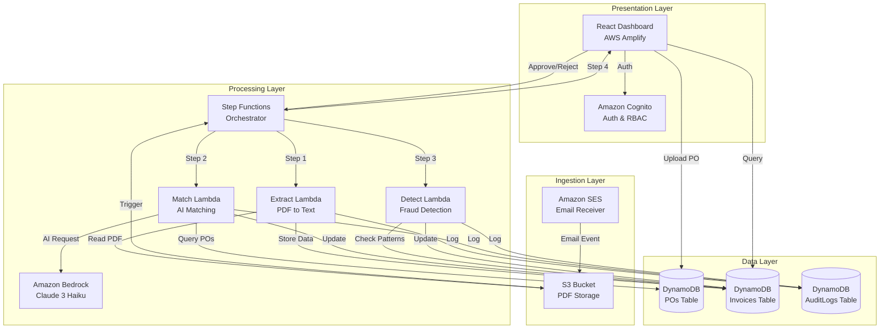
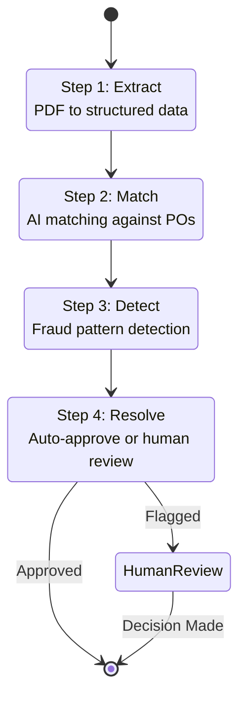

# Design Document: ReconcileAI

## Overview

ReconcileAI is a serverless accounts payable automation system built entirely on AWS Free Tier services. The system follows an event-driven architecture where incoming invoice emails trigger a processing pipeline that extracts data, matches against purchase orders using AI, detects fraud, and routes discrepancies to human approvers. The architecture prioritizes cost efficiency, auditability, and explainability.

The system consists of three main layers:
1. **Presentation Layer**: React dashboard hosted on AWS Amplify with Cognito authentication
2. **Processing Layer**: Lambda functions orchestrated by Step Functions for invoice processing
3. **Data Layer**: DynamoDB tables for POs, invoices, and audit logs; S3 for PDF storage

## Architecture

### High-Level Architecture



### Step Functions Workflow

The Step Functions workflow orchestrates invoice processing with exactly 4 steps to stay within Free Tier limits:



## Components and Interfaces

### Frontend Components

#### 1. Authentication Module
- **Technology**: React + AWS Amplify Auth
- **Integration**: Amazon Cognito User Pools
- **Responsibilities**:
  - User login/logout
  - Role-based access control (Admin/User)
  - Session management
  - Token refresh

**Interface**:
```typescript
interface AuthService {
  signIn(username: string, password: string): Promise<AuthResult>
  signOut(): Promise<void>
  getCurrentUser(): Promise<User>
  getUserRole(): Promise<Role>
}

interface User {
  userId: string
  username: string
  email: string
  role: Role
}

enum Role {
  ADMIN = "Admin",
  USER = "User"
}

interface AuthResult {
  user: User
  accessToken: string
  idToken: string
}
```

#### 2. PO Management Component
- **Technology**: React functional components with hooks
- **Responsibilities**:
  - PO upload with validation
  - PO search and filtering
  - PO detail display

**Interface**:
```typescript
interface POService {
  uploadPO(file: File, metadata: POMetadata): Promise<PO>
  searchPOs(query: POSearchQuery): Promise<PO[]>
  getPOById(poId: string): Promise<PO>
}

interface POMetadata {
  vendorName: string
  poNumber: string
  totalAmount: number
  lineItems: LineItem[]
}

interface LineItem {
  itemDescription: string
  quantity: number
  unitPrice: number
  totalPrice: number
}

interface POSearchQuery {
  poNumber?: string
  vendorName?: string
  dateFrom?: string
  dateTo?: string
}
```

#### 3. Invoice Review Component
- **Technology**: React functional components
- **Responsibilities**:
  - Display invoice list with status
  - Show invoice details with matched PO
  - Display AI explainability reasoning
  - Approval/rejection actions

**Interface**:
```typescript
interface InvoiceService {
  getInvoices(filter: InvoiceFilter): Promise<Invoice[]>
  getInvoiceById(invoiceId: string): Promise<InvoiceDetail>
  approveInvoice(invoiceId: string, comment: string): Promise<void>
  rejectInvoice(invoiceId: string, reason: string): Promise<void>
}

interface InvoiceFilter {
  status?: InvoiceStatus
  vendorName?: string
  dateFrom?: string
  dateTo?: string
}

enum InvoiceStatus {
  PROCESSING = "Processing",
  MATCHED = "Matched",
  FLAGGED = "Flagged",
  APPROVED = "Approved",
  REJECTED = "Rejected"
}

interface InvoiceDetail {
  invoice: Invoice
  matchedPOs: PO[]
  discrepancies: Discrepancy[]
  fraudFlags: FraudFlag[]
  aiReasoning: string
  auditTrail: AuditEntry[]
}
```

#### 4. Audit Trail Component
- **Technology**: React table component
- **Responsibilities**:
  - Display audit logs with filtering
  - Search by entity, actor, or action type
  - Export audit data

**Interface**:
```typescript
interface AuditService {
  getAuditLogs(filter: AuditFilter): Promise<AuditEntry[]>
  exportAuditLogs(filter: AuditFilter): Promise<Blob>
}

interface AuditFilter {
  entityId?: string
  actor?: string
  actionType?: string
  dateFrom?: string
  dateTo?: string
}
```

### Backend Components

#### 1. Email Ingestion Handler
- **Technology**: AWS Lambda (Node.js, ARM)
- **Trigger**: Amazon SES email receipt
- **Responsibilities**:
  - Parse incoming email
  - Extract PDF attachments
  - Store PDFs in S3
  - Trigger Step Functions

**Interface**:
```typescript
interface EmailIngestionHandler {
  handleSESEvent(event: SESEvent): Promise<void>
}

interface SESEvent {
  Records: SESRecord[]
}

interface SESRecord {
  ses: {
    mail: {
      messageId: string
      source: string
      destination: string[]
      timestamp: string
    }
    receipt: {
      recipients: string[]
      attachments: Attachment[]
    }
  }
}

interface Attachment {
  filename: string
  contentType: string
  content: Buffer
}
```

#### 2. PDF Extraction Lambda
- **Technology**: AWS Lambda (Python, ARM) with pdf-plumber
- **Responsibilities**:
  - Extract text from PDF
  - Parse invoice structure
  - Store extracted data in DynamoDB
  - Log extraction to audit trail

**Interface**:
```python
class PDFExtractionHandler:
    def extract_invoice_data(self, s3_bucket: str, s3_key: str) -> InvoiceData
    def parse_invoice_text(self, text: str) -> InvoiceData
    def store_invoice_data(self, invoice_data: InvoiceData) -> str

class InvoiceData:
    invoice_number: str
    vendor_name: str
    invoice_date: str
    line_items: List[LineItem]
    total_amount: float
    raw_text: str
```

#### 3. AI Matching Lambda
- **Technology**: AWS Lambda (Python, ARM)
- **Integration**: Amazon Bedrock Claude 3 Haiku
- **Responsibilities**:
  - Query relevant POs from DynamoDB
  - Send invoice and PO data to Bedrock
  - Parse AI response for matches and discrepancies
  - Generate explainability reasoning
  - Update invoice with match results

**Interface**:
```python
class AIMatchingHandler:
    def match_invoice_to_pos(self, invoice_id: str) -> MatchResult
    def query_relevant_pos(self, vendor_name: str, date_range: DateRange) -> List[PO]
    def call_bedrock_api(self, prompt: str) -> BedrockResponse
    def parse_match_result(self, response: BedrockResponse) -> MatchResult

class MatchResult:
    invoice_id: str
    matched_po_ids: List[str]
    discrepancies: List[Discrepancy]
    confidence_score: float
    reasoning: str
    is_perfect_match: bool

class Discrepancy:
    type: DiscrepancyType  # PRICE, QUANTITY, ITEM
    invoice_line: LineItem
    po_line: LineItem
    difference: float
    description: str

enum DiscrepancyType:
    PRICE_MISMATCH
    QUANTITY_MISMATCH
    ITEM_NOT_FOUND
    AMOUNT_EXCEEDED
```

**Bedrock Prompt Structure**:
```
You are an accounts payable clerk matching an invoice to purchase orders.

INVOICE:
- Number: {invoice_number}
- Vendor: {vendor_name}
- Date: {invoice_date}
- Line Items:
  {invoice_line_items}
- Total: {invoice_total}

PURCHASE ORDERS:
{po_list}

TASK:
1. Match each invoice line item to PO line items
2. Identify any discrepancies (price, quantity, item)
3. Calculate confidence score (0-100)
4. Provide step-by-step reasoning

Respond in JSON format:
{
  "matched_po_ids": ["PO123"],
  "line_matches": [
    {
      "invoice_line": 1,
      "po_id": "PO123",
      "po_line": 2,
      "match_confidence": 95,
      "discrepancies": []
    }
  ],
  "overall_confidence": 90,
  "reasoning": "Step-by-step explanation...",
  "is_perfect_match": true
}
```

#### 4. Fraud Detection Lambda
- **Technology**: AWS Lambda (Python, ARM)
- **Responsibilities**:
  - Check for price spikes
  - Detect unrecognized vendors
  - Identify duplicate invoices
  - Flag amount exceedances
  - Update invoice with fraud flags

**Interface**:
```python
class FraudDetectionHandler:
    def detect_fraud(self, invoice_id: str) -> FraudResult
    def check_price_spikes(self, invoice: Invoice, historical_data: List[Invoice]) -> Optional[FraudFlag]
    def check_unrecognized_vendor(self, vendor_name: str) -> Optional[FraudFlag]
    def check_duplicate_invoice(self, invoice_number: str, vendor_name: str) -> Optional[FraudFlag]
    def check_amount_exceedance(self, invoice: Invoice, matched_pos: List[PO]) -> Optional[FraudFlag]

class FraudResult:
    invoice_id: str
    fraud_flags: List[FraudFlag]
    risk_score: int  # 0-100
    requires_review: bool

class FraudFlag:
    flag_type: FraudFlagType
    severity: Severity  # LOW, MEDIUM, HIGH
    description: str
    evidence: Dict[str, Any]

enum FraudFlagType:
    PRICE_SPIKE
    UNRECOGNIZED_VENDOR
    DUPLICATE_INVOICE
    AMOUNT_EXCEEDED
```

#### 5. Approval Handler Lambda
- **Technology**: AWS Lambda (Node.js, ARM)
- **Responsibilities**:
  - Process approval/rejection decisions
  - Resume Step Functions execution
  - Send notifications
  - Update audit trail

**Interface**:
```typescript
interface ApprovalHandler {
  processApproval(request: ApprovalRequest): Promise<void>
  resumeStepFunction(executionArn: string, decision: Decision): Promise<void>
  sendNotification(recipient: string, message: string): Promise<void>
}

interface ApprovalRequest {
  invoiceId: string
  approverId: string
  decision: Decision
  comment: string
  timestamp: string
}

enum Decision {
  APPROVED = "Approved",
  REJECTED = "Rejected",
  REQUEST_INFO = "RequestInfo"
}
```

## Data Models

### DynamoDB Tables

#### 1. POs Table
```typescript
interface PO {
  POId: string              // Partition Key (UUID)
  VendorName: string        // GSI Partition Key
  PONumber: string          // Unique business identifier
  LineItems: LineItem[]
  TotalAmount: number
  UploadDate: string        // ISO 8601 timestamp
  UploadedBy: string        // User ID
  Status: POStatus
}

enum POStatus {
  ACTIVE = "Active",
  FULLY_MATCHED = "FullyMatched",
  PARTIALLY_MATCHED = "PartiallyMatched",
  EXPIRED = "Expired"
}

interface LineItem {
  LineNumber: number
  ItemDescription: string
  Quantity: number
  UnitPrice: number
  TotalPrice: number
  MatchedQuantity: number   // Track partial matches
}

// Global Secondary Index
// GSI1: VendorName (PK) + UploadDate (SK)
```

#### 2. Invoices Table
```typescript
interface Invoice {
  InvoiceId: string         // Partition Key (UUID)
  VendorName: string        // GSI Partition Key
  InvoiceNumber: string
  InvoiceDate: string       // ISO 8601
  LineItems: LineItem[]
  TotalAmount: number
  Status: InvoiceStatus
  MatchedPOIds: string[]
  Discrepancies: Discrepancy[]
  FraudFlags: FraudFlag[]
  AIReasoning: string
  ReceivedDate: string      // ISO 8601
  S3Key: string             // Reference to PDF in S3
  StepFunctionArn: string   // For resuming workflow
}

enum InvoiceStatus {
  RECEIVED = "Received",
  EXTRACTING = "Extracting",
  MATCHING = "Matching",
  DETECTING = "Detecting",
  FLAGGED = "Flagged",
  APPROVED = "Approved",
  REJECTED = "Rejected"
}

// Global Secondary Indexes
// GSI1: VendorName (PK) + ReceivedDate (SK)
// GSI2: Status (PK) + ReceivedDate (SK)
```

#### 3. AuditLogs Table
```typescript
interface AuditLog {
  LogId: string             // Partition Key (UUID)
  Timestamp: string         // Sort Key (ISO 8601)
  Actor: string             // User ID or "System"
  ActionType: ActionType
  EntityType: EntityType
  EntityId: string
  Details: Record<string, any>
  Reasoning: string         // For AI decisions
  IPAddress?: string
  UserAgent?: string
}

enum ActionType {
  PO_UPLOADED = "POUploaded",
  INVOICE_RECEIVED = "InvoiceReceived",
  INVOICE_EXTRACTED = "InvoiceExtracted",
  INVOICE_MATCHED = "InvoiceMatched",
  FRAUD_DETECTED = "FraudDetected",
  INVOICE_APPROVED = "InvoiceApproved",
  INVOICE_REJECTED = "InvoiceRejected",
  EMAIL_CONFIGURED = "EmailConfigured"
}

enum EntityType {
  PO = "PO",
  INVOICE = "Invoice",
  USER = "User",
  EMAIL_CONFIG = "EmailConfig"
}

// Global Secondary Index
// GSI1: EntityId (PK) + Timestamp (SK)
```

### S3 Bucket Structure

```
reconcile-ai-invoices/
├── invoices/
│   ├── {year}/
│   │   ├── {month}/
│   │   │   ├── {invoice-id}.pdf
│   │   │   └── ...
│   └── ...
└── temp/
    └── {email-message-id}/
        └── attachments/
```

### Cognito User Pool

```typescript
interface CognitoUser {
  sub: string               // User ID
  email: string
  email_verified: boolean
  "custom:role": Role       // Custom attribute
  "custom:full_name": string
}
```

## 
Correctness Properties

### What are Correctness Properties?

A property is a characteristic or behavior that should hold true across all valid executions of a system—essentially, a formal statement about what the system should do. Properties serve as the bridge between human-readable specifications and machine-verifiable correctness guarantees.

In ReconcileAI, correctness properties ensure that invoice processing, AI matching, fraud detection, and approval workflows behave correctly across all possible inputs and scenarios. These properties will be validated through property-based testing during implementation.

### Core System Properties

#### Property 1: Role Permission Hierarchy
*For any* Admin user and any User with User role, the Admin should have all permissions that the User has, plus additional configuration permissions.
**Validates: Requirements 1.4**

#### Property 2: PO Validation Completeness
*For any* PO upload attempt, if the PO is missing any required field (PO number, vendor, line items, quantities, or prices), the validation should reject it and prevent storage.
**Validates: Requirements 2.1**

#### Property 3: PO Storage Round Trip
*For any* valid PO, uploading it and then retrieving it by ID should return an equivalent PO with all line items and pricing intact.
**Validates: Requirements 2.2, 2.5**

#### Property 4: PO ID Uniqueness
*For any* set of uploaded POs, all assigned PO IDs should be unique with no collisions.
**Validates: Requirements 2.3**

#### Property 5: PO Search Accuracy
*For any* PO search query (by PO number, vendor name, or date range), all returned results should match the search criteria, and all POs matching the criteria should be in the results.
**Validates: Requirements 2.4**

#### Property 6: PDF Attachment Extraction Completeness
*For any* email with N PDF attachments, the extraction process should identify and extract exactly N PDFs.
**Validates: Requirements 3.2**

#### Property 7: PDF Storage Uniqueness
*For any* set of extracted PDFs, all assigned S3 keys should be unique with no collisions.
**Validates: Requirements 3.3**

#### Property 8: Workflow Trigger Consistency
*For any* PDF stored in S3, exactly one Step Function execution should be triggered.
**Validates: Requirements 3.4, 11.3**

#### Property 9: Invoice Data Extraction Completeness
*For any* successfully extracted invoice, the stored data should contain invoice number, vendor name, invoice date, line items, and total amount.
**Validates: Requirements 4.1, 4.2, 4.4**

#### Property 10: PDF Preservation
*For any* invoice processed by the system, the original PDF should remain in S3 and be retrievable using the stored S3 key.
**Validates: Requirements 4.5**

#### Property 11: Relevant PO Retrieval
*For any* invoice with vendor name V and date D, the AI matching should query POs with vendor name V and dates within a reasonable range of D.
**Validates: Requirements 5.1**

#### Property 12: Perfect Match Classification
*For any* invoice where all line items match PO line items within acceptable tolerances (±5% price, exact quantity, matching description), the system should classify it as a perfect match.
**Validates: Requirements 5.3**

#### Property 13: Discrepancy Detection Completeness
*For any* invoice line item that differs from PO line items by more than acceptable tolerances, the system should identify and record a specific discrepancy with type, difference amount, and description.
**Validates: Requirements 5.4**

#### Property 14: AI Reasoning Generation
*For any* invoice matching operation, the AI should generate step-by-step reasoning that includes which POs were considered and how line items were matched.
**Validates: Requirements 6.1, 6.4**

#### Property 15: Audit Log Completeness for AI Decisions
*For any* AI matching decision, the audit log should contain an entry with timestamp, reasoning, confidence score, matched PO IDs, and discrepancies.
**Validates: Requirements 6.2, 10.2**

#### Property 16: Price Spike Detection
*For any* invoice line item where the price exceeds the historical average for the same vendor and item by more than 20%, the system should flag it with a PRICE_SPIKE fraud flag.
**Validates: Requirements 7.1**

#### Property 17: Unrecognized Vendor Detection
*For any* invoice from a vendor with no matching POs in the system, the system should flag it with an UNRECOGNIZED_VENDOR fraud flag.
**Validates: Requirements 7.2**

#### Property 18: Duplicate Invoice Detection
*For any* invoice with an invoice number that already exists for the same vendor, the system should flag it with a DUPLICATE_INVOICE fraud flag.
**Validates: Requirements 7.3**

#### Property 19: Amount Exceedance Detection
*For any* invoice where the total amount exceeds the matched PO total by more than 10%, the system should flag it with an AMOUNT_EXCEEDED fraud flag.
**Validates: Requirements 7.4**

#### Property 20: Workflow Pause on Flags
*For any* invoice with at least one discrepancy or fraud flag, the Step Function should pause and create an approval request rather than auto-approving.
**Validates: Requirements 7.5, 8.1**

#### Property 21: Approval Notification
*For any* approval request created, the system should send notifications to designated approvers via both dashboard and email.
**Validates: Requirements 8.2**

#### Property 22: Flagged Invoice Display Completeness
*For any* flagged invoice viewed by an approver, the display should include invoice details, matched PO details, all discrepancies, all fraud flags, and AI reasoning.
**Validates: Requirements 8.3**

#### Property 23: Approval Workflow Resumption
*For any* flagged invoice that receives an approval decision, the Step Function should resume execution and update the invoice status to "Approved".
**Validates: Requirements 8.5, 9.3**

#### Property 24: Rejection Workflow Termination
*For any* flagged invoice that receives a rejection decision, the system should update the invoice status to "Rejected" and halt the Step Function without further processing.
**Validates: Requirements 8.6**

#### Property 25: Auto-Approval for Clean Invoices
*For any* invoice with zero discrepancies and zero fraud flags, the system should automatically approve it without human intervention.
**Validates: Requirements 9.1**

#### Property 26: Auto-Approval Audit Logging
*For any* automatically approved invoice, the audit log should contain an entry with timestamp, "System" as actor, approval reasoning, and the invoice ID.
**Validates: Requirements 9.2, 10.1**

#### Property 27: Step Function Completion for Auto-Approvals
*For any* automatically approved invoice, the Step Function execution should complete successfully with status "SUCCEEDED".
**Validates: Requirements 9.4**

#### Property 28: Comprehensive Audit Logging
*For any* system action (PO upload, invoice received, extraction, matching, fraud detection, approval, rejection), an audit log entry should be created with timestamp, actor, action type, entity type, entity ID, and details.
**Validates: Requirements 10.1, 10.4**

#### Property 29: Human Action Audit Logging
*For any* human approval or rejection, the audit log should contain the approver's user ID, timestamp, decision, and optional comment.
**Validates: Requirements 10.3**

#### Property 30: Audit Trail Search Accuracy
*For any* audit log search query (by entity ID, actor, action type, or date range), all returned results should match the search criteria.
**Validates: Requirements 10.6**

#### Property 31: Step Function Retry Logic
*For any* Step Function step that fails with a retryable error, the system should retry up to 3 times with exponential backoff before marking as failed.
**Validates: Requirements 11.4, 16.1**

#### Property 32: Permanent Failure Handling
*For any* Step Function step that fails after all retries, the system should log the error to audit logs and flag the invoice for manual review.
**Validates: Requirements 11.5, 4.3, 16.2**

#### Property 33: Dashboard Invoice Summary Display
*For any* user login, the dashboard should display a summary containing recent invoices with their statuses (Processing, Matched, Flagged, Approved, Rejected).
**Validates: Requirements 13.2**

#### Property 34: Email Configuration Validation
*For any* email address input to the configuration interface, the system should validate it matches standard email format before allowing configuration.
**Validates: Requirements 14.3**

#### Property 35: Email Configuration Storage
*For any* valid email address added by an admin, the system should store the configuration and display it in the configured email addresses list.
**Validates: Requirements 14.2, 14.4**

#### Property 36: Email Configuration Removal
*For any* configured email address removed by an admin, the system should stop receiving emails at that address and remove it from the displayed list.
**Validates: Requirements 14.5**

#### Property 37: AI Service Retry Logic
*For any* AI Engine request that fails due to service unavailability, the system should queue the request and retry after 5 minutes.
**Validates: Requirements 16.3**

#### Property 38: DynamoDB Throttling Backoff
*For any* DynamoDB operation that receives a throttling error, the system should implement exponential backoff with jitter before retrying.
**Validates: Requirements 16.4**

#### Property 39: Error Logging Completeness
*For any* error that occurs in any Lambda function, the system should log it to CloudWatch with error message, stack trace, context (invoice ID, PO ID, etc.), and timestamp.
**Validates: Requirements 16.5**

#### Property 40: Critical Error Notifications
*For any* critical error (Step Function failure after retries, AI service prolonged unavailability, DynamoDB access failure), the system should send email notifications to all admin users.
**Validates: Requirements 16.6**

#### Property 41: Parallel Invoice Processing
*For any* set of invoices arriving simultaneously, the system should process them in parallel with each invoice having its own Step Function execution.
**Validates: Requirements 17.3**

#### Property 42: Input Sanitization
*For any* user input (PO data, search queries, approval comments), the system should sanitize it to remove or escape special characters that could cause injection attacks.
**Validates: Requirements 18.5**

## Error Handling

### Error Categories

**1. Transient Errors** (Retry with exponential backoff):
- Lambda timeout or memory errors
- DynamoDB throttling
- Bedrock API rate limiting
- Network connectivity issues

**2. Permanent Errors** (Flag for manual review):
- Malformed PDF that cannot be parsed
- Invoice with no extractable text
- AI response that cannot be parsed
- Missing required fields in extracted data

**3. Business Logic Errors** (Route to approval workflow):
- Discrepancies between invoice and PO
- Fraud flags detected
- Unrecognized vendor
- Amount exceedances

### Error Handling Patterns

**Lambda Function Error Handling**:
```python
def lambda_handler(event, context):
    try:
        # Main processing logic
        result = process_invoice(event)
        
        # Log success
        audit_log.log_action(
            actor="System",
            action_type="InvoiceProcessed",
            entity_id=result.invoice_id,
            details=result.to_dict()
        )
        
        return {
            'statusCode': 200,
            'body': json.dumps(result.to_dict())
        }
        
    except RetryableError as e:
        # Log and raise for Step Functions retry
        logger.error(f"Retryable error: {str(e)}", exc_info=True)
        audit_log.log_error(
            action_type="ProcessingError",
            error_type="Retryable",
            details={"error": str(e), "invoice_id": event.get('invoice_id')}
        )
        raise
        
    except PermanentError as e:
        # Log and flag for manual review
        logger.error(f"Permanent error: {str(e)}", exc_info=True)
        flag_for_manual_review(
            invoice_id=event.get('invoice_id'),
            reason=str(e)
        )
        audit_log.log_error(
            action_type="ProcessingError",
            error_type="Permanent",
            details={"error": str(e), "invoice_id": event.get('invoice_id')}
        )
        return {
            'statusCode': 200,  # Don't retry
            'body': json.dumps({'status': 'flagged', 'reason': str(e)})
        }
        
    except Exception as e:
        # Unexpected error - log and notify admins
        logger.critical(f"Unexpected error: {str(e)}", exc_info=True)
        notify_admins(
            subject="Critical Error in Invoice Processing",
            message=f"Unexpected error: {str(e)}\nInvoice: {event.get('invoice_id')}"
        )
        raise
```

**Step Functions Retry Configuration**:
```json
{
  "Retry": [
    {
      "ErrorEquals": ["Lambda.ServiceException", "Lambda.TooManyRequestsException"],
      "IntervalSeconds": 2,
      "MaxAttempts": 3,
      "BackoffRate": 2.0
    },
    {
      "ErrorEquals": ["States.TaskFailed"],
      "IntervalSeconds": 5,
      "MaxAttempts": 3,
      "BackoffRate": 2.0
    }
  ],
  "Catch": [
    {
      "ErrorEquals": ["States.ALL"],
      "Next": "FlagForManualReview"
    }
  ]
}
```

**DynamoDB Throttling Handler**:
```python
import time
import random

def dynamodb_operation_with_backoff(operation, max_retries=5):
    """Execute DynamoDB operation with exponential backoff and jitter"""
    for attempt in range(max_retries):
        try:
            return operation()
        except ClientError as e:
            if e.response['Error']['Code'] == 'ProvisionedThroughputExceededException':
                if attempt == max_retries - 1:
                    raise
                # Exponential backoff with jitter
                wait_time = (2 ** attempt) + random.uniform(0, 1)
                time.sleep(wait_time)
            else:
                raise
```

## Testing Strategy

### Dual Testing Approach

ReconcileAI requires both unit testing and property-based testing to ensure comprehensive coverage:

**Unit Tests**: Validate specific examples, edge cases, and error conditions
- Test specific invoice formats and PO structures
- Test edge cases (empty emails, malformed PDFs, missing fields)
- Test error conditions (service unavailability, throttling, timeouts)
- Test integration points between components
- Focus on concrete scenarios that demonstrate correct behavior

**Property Tests**: Validate universal properties across all inputs
- Test properties hold for randomly generated invoices, POs, and user inputs
- Verify matching logic works correctly across diverse data
- Ensure fraud detection catches all pattern violations
- Validate audit logging completeness for all actions
- Run minimum 100 iterations per property test to cover input space

### Property-Based Testing Configuration

**Testing Library**: Use `hypothesis` for Python Lambda functions, `fast-check` for TypeScript/Node.js Lambda functions

**Test Configuration**:
- Minimum 100 iterations per property test
- Each test must reference its design document property
- Tag format: `# Feature: reconcile-ai, Property {number}: {property_text}`

**Example Property Test Structure**:
```python
from hypothesis import given, strategies as st
import pytest

# Feature: reconcile-ai, Property 12: Perfect Match Classification
@given(
    invoice=st.builds(Invoice, 
        line_items=st.lists(st.builds(LineItem, 
            quantity=st.integers(1, 100),
            unit_price=st.floats(0.01, 10000.0)
        ), min_size=1, max_size=20)
    ),
    po=st.builds(PO,
        line_items=st.lists(st.builds(LineItem,
            quantity=st.integers(1, 100),
            unit_price=st.floats(0.01, 10000.0)
        ), min_size=1, max_size=20)
    )
)
@pytest.mark.property_test
def test_perfect_match_classification(invoice, po):
    """
    Property 12: For any invoice where all line items match PO line items 
    within acceptable tolerances, the system should classify it as a perfect match.
    """
    # Ensure invoice matches PO within tolerances
    invoice = align_invoice_to_po(invoice, po, tolerance=0.05)
    
    # Run matching
    result = ai_matching_service.match_invoice_to_pos(invoice, [po])
    
    # Assert perfect match classification
    assert result.is_perfect_match == True
    assert len(result.discrepancies) == 0
    assert result.confidence_score >= 90
```

### Testing Priorities

**Phase 1: Core Functionality**
1. PO upload and storage (Properties 2, 3, 4)
2. Invoice extraction and storage (Properties 9, 10)
3. AI matching logic (Properties 12, 13, 14)
4. Audit logging (Properties 15, 26, 28)

**Phase 2: Fraud Detection**
1. Price spike detection (Property 16)
2. Unrecognized vendor detection (Property 17)
3. Duplicate invoice detection (Property 18)
4. Amount exceedance detection (Property 19)

**Phase 3: Approval Workflows**
1. Workflow pause on flags (Property 20)
2. Auto-approval for clean invoices (Property 25)
3. Approval/rejection handling (Properties 23, 24)
4. Notification system (Property 21)

**Phase 4: Error Handling & Resilience**
1. Retry logic (Properties 31, 37, 38)
2. Permanent failure handling (Property 32)
3. Error logging and notifications (Properties 39, 40)

### AWS Free Tier Testing Considerations

**Cost-Conscious Testing**:
- Use LocalStack or AWS SAM Local for local Lambda testing
- Mock Bedrock API calls in unit tests to avoid token costs
- Use DynamoDB Local for local development
- Limit integration tests to essential end-to-end scenarios
- Run property tests locally before deploying to AWS
- Monitor AWS usage during testing to stay within Free Tier

**Integration Testing Strategy**:
- Deploy to AWS only for final integration validation
- Use small test datasets (< 10 invoices per test run)
- Clean up test data immediately after tests
- Schedule integration tests to run once per day maximum
- Use CloudWatch metrics to monitor Free Tier usage

## Implementation Notes

### AWS Free Tier Optimization

**Lambda Optimization**:
- Use ARM/Graviton2 architecture for all Lambda functions
- Keep function memory at minimum required (128MB-512MB)
- Minimize cold starts by keeping functions warm during business hours
- Batch DynamoDB operations where possible
- Use Lambda layers for shared dependencies

**DynamoDB Optimization**:
- Use On-Demand billing mode (included in Free Tier)
- Design efficient partition keys to avoid hot partitions
- Use sparse indexes to reduce storage costs
- Implement TTL for temporary data (email processing state)
- Batch read/write operations to reduce request count

**Bedrock Optimization**:
- Use Claude 3 Haiku exclusively (fastest, cheapest)
- Minimize prompt length by sending only essential data
- Limit response length with max_tokens parameter
- Cache common AI responses where appropriate
- Implement request batching for multiple invoices

**Step Functions Optimization**:
- Keep workflow to exactly 4 steps (Extract, Match, Detect, Resolve)
- Use Express Workflows for high-volume scenarios (cheaper)
- Minimize state data passed between steps
- Implement early termination for auto-approved invoices

### Security Considerations

**Authentication & Authorization**:
- Cognito User Pools with MFA enabled for admins
- Custom attributes for role storage
- JWT token validation in all API calls
- Session timeout after 1 hour of inactivity

**Data Protection**:
- S3 bucket encryption with AWS managed keys (SSE-S3)
- DynamoDB encryption at rest enabled
- TLS 1.2+ for all data in transit
- Signed URLs for PDF access with 5-minute expiration

**IAM Policies**:
- Least privilege for all Lambda execution roles
- Separate roles for each Lambda function
- No wildcard permissions in production
- Resource-based policies for S3 and DynamoDB

**Input Validation**:
- Sanitize all user inputs before storage
- Validate email addresses with regex
- Limit file upload sizes (10MB max per PDF)
- Validate JSON payloads against schemas

### Monitoring and Observability

**CloudWatch Metrics**:
- Lambda invocation count and duration
- DynamoDB read/write capacity usage
- Step Functions execution count and status
- Bedrock API call count and latency
- S3 storage usage and request count

**CloudWatch Alarms**:
- Alert when approaching Free Tier limits (80% threshold)
- Alert on Step Function failures
- Alert on Lambda error rate > 5%
- Alert on DynamoDB throttling events

**Audit Trail Queries**:
- Daily summary of processed invoices
- Weekly report of fraud flags and approvals
- Monthly compliance report for auditors
- Real-time dashboard of system health

### Deployment Strategy

**Infrastructure as Code**:
- Use AWS CDK (TypeScript) for infrastructure definition
- Separate stacks for different environments (dev, prod)
- Automated deployment via CI/CD pipeline
- Rollback capability for failed deployments

**Environment Configuration**:
- Use AWS Systems Manager Parameter Store for configuration
- Environment-specific parameters (email addresses, thresholds)
- Secrets stored in AWS Secrets Manager
- Configuration versioning for audit trail

**Deployment Phases**:
1. Week 1: Amplify frontend + Cognito authentication
2. Week 2: DynamoDB tables + S3 bucket setup
3. Week 3: SES email ingestion + Step Functions
4. Week 4: Lambda functions (Extract, Match, Detect)
5. Week 5: Fraud detection logic + explainability
6. Week 6: Approval workflow + notifications
7. Week 7: Audit logging + dashboard integration + testing
