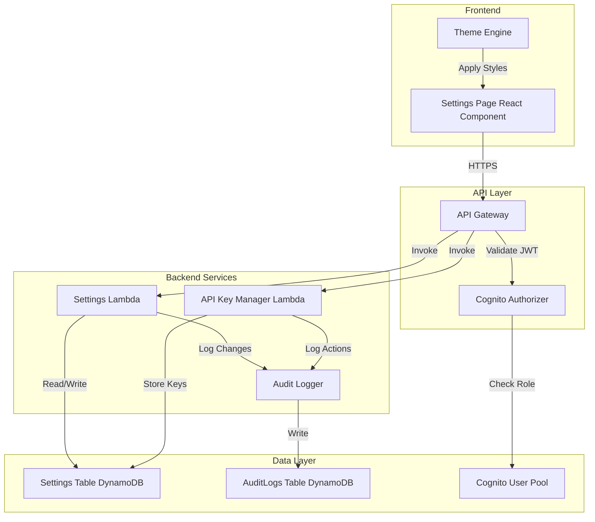

# Design Document: Settings Page

## Overview

The Settings Page feature provides a centralized, role-based configuration interface for ReconcileAI. It enables administrators to manage system-wide settings (reconciliation thresholds, fraud detection sensitivity, API keys) while allowing standard users to customize personal preferences (theme, notifications). The feature is built on AWS serverless architecture using Lambda functions, API Gateway, DynamoDB, and Cognito for authentication and authorization.

The design follows AWS Free Tier constraints by using ARM/Graviton2 Lambda functions, DynamoDB On-Demand mode, and implementing response caching to minimize read operations. All settings changes are audited to the existing AuditLogs table for compliance tracking.

## Architecture

### High-Level Architecture



### Component Interaction Flow

1. **User Authentication**: User logs in via Cognito, receives JWT token with role claims
2. **Settings Request**: Frontend sends GET /settings with JWT in Authorization header
3. **Authorization**: API Gateway validates JWT via Cognito Authorizer, extracts user identity and role
4. **Role-Based Filtering**: Settings Lambda queries DynamoDB and filters results based on user role
5. **Response Caching**: Lambda caches responses for 5 minutes to reduce DynamoDB reads
6. **Settings Update**: User modifies settings, frontend sends PUT request
7. **Validation**: Lambda validates input against constraints and sanitizes data
8. **Persistence**: Lambda writes to DynamoDB with optimistic locking
9. **Audit Logging**: Lambda asynchronously logs change to AuditLogs table
10. **Theme Application**: Theme Engine applies CSS changes without page refresh

## Components and Interfaces

### Frontend Components

#### SettingsPage Component
- **Responsibility**: Main container for settings interface
- **State Management**: 
  - `settings`: Current settings object
  - `loading`: Boolean for async operations
  - `error`: Error message display
  - `isDirty`: Tracks unsaved changes
- **Sections**:
  - System Configuration (Admin only)
  - Appearance (Theme selector)
  - Notifications (Email preferences)
  - API Keys (Admin only)
- **Props**: None (uses AuthContext for user info)

#### ThemeEngine Component
- **Responsibility**: Apply and persist theme changes
- **Methods**:
  - `applyTheme(theme: 'light' | 'dark')`: Updates CSS variables
  - `loadUserTheme()`: Fetches saved preference on mount
- **Storage**: Persists to DynamoDB via Settings API
- **Default**: Light mode if no preference exists

#### SystemConfigSection Component (Admin Only)
- **Fields**:
  - Reconciliation Threshold (number, 0-100, default: 5)
  - Auto-Approval Limit (currency, 0-10000, default: 1000)
  - Fraud Detection Sensitivity (enum: low/medium/high, default: medium)
- **Validation**: Client-side validation before submission

#### NotificationPreferencesSection Component
- **Fields**:
  - Invoice Received (boolean toggle)
  - Reconciliation Completed (boolean toggle)
  - Discrepancy Detected (boolean toggle)
  - Approval Required (boolean toggle)
- **Default**: All enabled for new users

#### APIKeyManagementSection Component (Admin Only)
- **Features**:
  - Generate new API key button
  - Display generated key once (copy-to-clipboard)
  - List existing keys (last 4 chars, creation date, description)
  - Revoke key action
- **Security**: Keys never displayed after initial generation

### Backend Components

#### Settings Lambda Function
- **Runtime**: Python 3.11 on ARM64/Graviton2
- **Memory**: 256MB
- **Timeout**: 30 seconds
- **Handler**: `index.lambda_handler`
- **Environment Variables**:
  - `SETTINGS_TABLE_NAME`: DynamoDB table name
  - `AUDIT_LOGS_TABLE_NAME`: Audit logs table name
  - `CACHE_TTL`: Response cache TTL (300 seconds)

**Endpoints Handled**:
- `GET /settings`: Retrieve all settings for authenticated user
- `PUT /settings/{settingType}/{settingKey}`: Update specific setting
- `GET /settings/system`: Get system configuration (Admin only)
- `PUT /settings/system`: Update system configuration (Admin only)

**Methods**:
```python
def get_settings(user_id: str, role: str) -> dict
def update_setting(setting_type: str, setting_key: str, value: any, user_id: str, role: str) -> dict
def validate_setting_value(setting_type: str, setting_key: str, value: any) -> bool
def sanitize_input(value: str) -> str
def check_role_permission(role: str, setting_type: str) -> bool
```

#### API Key Manager Lambda Function
- **Runtime**: Python 3.11 on ARM64/Graviton2
- **Memory**: 256MB
- **Timeout**: 30 seconds
- **Handler**: `index.lambda_handler`
- **Environment Variables**:
  - `SETTINGS_TABLE_NAME`: DynamoDB table name
  - `AUDIT_LOGS_TABLE_NAME`: Audit logs table name

**Endpoints Handled**:
- `POST /settings/api-keys`: Generate new API key
- `GET /settings/api-keys`: List all API keys
- `DELETE /settings/api-keys/{keyId}`: Revoke API key
- `POST /settings/api-keys/validate`: Validate API key (internal)

**Methods**:
```python
def generate_api_key() -> str  # 32-char cryptographically secure random
def hash_api_key(key: str) -> str  # SHA-256 hash for storage
def store_api_key(key_hash: str, description: str, admin_id: str) -> dict
def revoke_api_key(key_id: str, admin_id: str) -> bool
def validate_api_key(key: str) -> bool
def list_api_keys() -> list
```

### API Gateway Endpoints

#### Settings Endpoints

**GET /settings**
- **Authorization**: Cognito JWT (Admin or User)
- **Response**: 
```json
{
  "user": {
    "theme": "dark",
    "notifications": {
      "invoiceReceived": true,
      "reconciliationCompleted": true,
      "discrepancyDetected": true,
      "approvalRequired": false
    }
  },
  "system": {  // Only if Admin role
    "reconciliationThreshold": 5,
    "autoApprovalLimit": 1000,
    "fraudDetectionSensitivity": "medium"
  }
}
```

**PUT /settings/{settingType}/{settingKey}**
- **Authorization**: Cognito JWT (role-based)
- **Request Body**:
```json
{
  "value": "dark",
  "version": 3  // For optimistic locking
}
```
- **Response**:
```json
{
  "success": true,
  "setting": {
    "settingType": "user",
    "settingKey": "theme",
    "value": "dark",
    "version": 4,
    "lastModified": "2024-01-15T10:30:00Z"
  }
}
```

**POST /settings/api-keys**
- **Authorization**: Cognito JWT (Admin only)
- **Request Body**:
```json
{
  "description": "Production API Integration"
}
```
- **Response**:
```json
{
  "apiKey": "a1b2c3d4e5f6g7h8i9j0k1l2m3n4o5p6",  // Shown only once
  "keyId": "key-123456",
  "createdAt": "2024-01-15T10:30:00Z",
  "description": "Production API Integration"
}
```

**GET /settings/api-keys**
- **Authorization**: Cognito JWT (Admin only)
- **Response**:
```json
{
  "keys": [
    {
      "keyId": "key-123456",
      "lastFourChars": "o5p6",
      "createdAt": "2024-01-15T10:30:00Z",
      "description": "Production API Integration",
      "status": "active"
    }
  ]
}
```

**DELETE /settings/api-keys/{keyId}**
- **Authorization**: Cognito JWT (Admin only)
- **Response**:
```json
{
  "success": true,
  "message": "API key revoked successfully"
}
```

## Data Models

### Settings Table Schema

**Table Name**: `ReconcileAI-Settings`

**Primary Key**:
- Partition Key: `settingType` (String) - Values: "system", "user", "api-key"
- Sort Key: `settingKey` (String) - Composite key format varies by type

**Attributes**:
```typescript
{
  settingType: string;        // "system" | "user" | "api-key"
  settingKey: string;         // For user: "userId#theme", for system: "reconciliationThreshold"
  value: any;                 // Setting value (string, number, boolean, object)
  userId?: string;            // Present for user settings
  version: number;            // For optimistic locking
  lastModified: string;       // ISO 8601 timestamp
  modifiedBy: string;         // Username or userId
  description?: string;       // For API keys
  keyHash?: string;           // SHA-256 hash for API keys
  status?: string;            // "active" | "revoked" for API keys
  createdAt?: string;         // For API keys
}
```

**Access Patterns**:
1. Get all user settings: Query with `settingType = "user"` and `settingKey` begins with `userId#`
2. Get all system settings: Query with `settingType = "system"`
3. Get specific setting: GetItem with `settingType` and `settingKey`
4. List API keys: Query with `settingType = "api-key"`
5. Validate API key: Query with `settingType = "api-key"` and filter by `keyHash`

**Global Secondary Indexes**:
- **UserIdIndex**: 
  - Partition Key: `userId`
  - Sort Key: `lastModified`
  - Purpose: Efficiently retrieve all settings for a user

### Setting Value Constraints

**System Settings**:
```typescript
{
  reconciliationThreshold: {
    type: "number",
    min: 0,
    max: 100,
    default: 5,
    description: "Percentage threshold for auto-matching"
  },
  autoApprovalLimit: {
    type: "number",
    min: 0,
    max: 10000,
    default: 1000,
    description: "Maximum amount for auto-approval (USD)"
  },
  fraudDetectionSensitivity: {
    type: "enum",
    values: ["low", "medium", "high"],
    default: "medium",
    description: "Fraud detection sensitivity level"
  }
}
```

**User Settings**:
```typescript
{
  theme: {
    type: "enum",
    values: ["light", "dark"],
    default: "light"
  },
  notifications: {
    type: "object",
    schema: {
      invoiceReceived: { type: "boolean", default: true },
      reconciliationCompleted: { type: "boolean", default: true },
      discrepancyDetected: { type: "boolean", default: true },
      approvalRequired: { type: "boolean", default: true }
    }
  }
}
```

### API Key Model

```typescript
{
  settingType: "api-key",
  settingKey: string,           // UUID v4
  keyHash: string,              // SHA-256 hash of the key
  lastFourChars: string,        // Last 4 characters for display
  description: string,          // User-provided description (max 255 chars)
  createdAt: string,            // ISO 8601 timestamp
  createdBy: string,            // Admin userId
  status: "active" | "revoked",
  revokedAt?: string,           // ISO 8601 timestamp
  revokedBy?: string            // Admin userId
}
```

### Audit Log Entry for Settings

```typescript
{
  LogId: string,                // UUID v4
  Timestamp: string,            // ISO 8601 timestamp
  EntityType: "Setting",
  EntityId: string,             // settingType#settingKey
  Action: "Create" | "Update" | "Delete" | "APIKeyGenerated" | "APIKeyRevoked",
  UserId: string,
  Username: string,
  Role: "Admin" | "User",
  Details: {
    settingType: string,
    settingKey: string,
    oldValue?: any,
    newValue?: any,
    ipAddress?: string
  }
}
```


## Error Handling

### Error Categories and Responses

#### Authentication Errors
- **401 Unauthorized**: Invalid or expired JWT token
  - Response: `{"error": "Authentication required", "code": "AUTH_REQUIRED"}`
  - Action: Redirect to login page

#### Authorization Errors
- **403 Forbidden**: User lacks permission for requested operation
  - Response: `{"error": "Insufficient permissions", "code": "FORBIDDEN", "requiredRole": "Admin"}`
  - Action: Display error message, hide admin-only sections

#### Validation Errors
- **400 Bad Request**: Invalid input data
  - Response: `{"error": "Validation failed", "code": "VALIDATION_ERROR", "details": [{"field": "reconciliationThreshold", "message": "Value must be between 0 and 100"}]}`
  - Action: Display inline validation errors, keep form in edit mode

#### Conflict Errors
- **409 Conflict**: Concurrent update detected (optimistic locking failure)
  - Response: `{"error": "Setting was modified by another user", "code": "CONFLICT", "currentVersion": 5}`
  - Action: Prompt user to refresh and retry

#### Service Errors
- **500 Internal Server Error**: Unexpected backend failure
  - Response: `{"error": "An unexpected error occurred", "code": "INTERNAL_ERROR", "requestId": "abc-123"}`
  - Action: Display generic error, log to CloudWatch, prompt retry

- **503 Service Unavailable**: DynamoDB or downstream service unavailable
  - Response: `{"error": "Service temporarily unavailable", "code": "SERVICE_UNAVAILABLE", "retryAfter": 30}`
  - Action: Display maintenance message, auto-retry after delay

### Error Handling Strategy

#### Lambda Function Error Handling

```python
def lambda_handler(event, context):
    try:
        # Extract user info from JWT
        user_id, role = extract_user_from_jwt(event)
        
        # Route to appropriate handler
        if event['httpMethod'] == 'GET':
            return handle_get_settings(user_id, role)
        elif event['httpMethod'] == 'PUT':
            return handle_update_setting(event, user_id, role)
            
    except AuthenticationError as e:
        return {
            'statusCode': 401,
            'body': json.dumps({'error': str(e), 'code': 'AUTH_REQUIRED'})
        }
    except AuthorizationError as e:
        return {
            'statusCode': 403,
            'body': json.dumps({'error': str(e), 'code': 'FORBIDDEN'})
        }
    except ValidationError as e:
        return {
            'statusCode': 400,
            'body': json.dumps({'error': str(e), 'code': 'VALIDATION_ERROR', 'details': e.details})
        }
    except ConflictError as e:
        return {
            'statusCode': 409,
            'body': json.dumps({'error': str(e), 'code': 'CONFLICT', 'currentVersion': e.version})
        }
    except ClientError as e:
        if e.response['Error']['Code'] == 'ConditionalCheckFailedException':
            return {
                'statusCode': 409,
                'body': json.dumps({'error': 'Concurrent update detected', 'code': 'CONFLICT'})
            }
        elif e.response['Error']['Code'] == 'ProvisionedThroughputExceededException':
            return {
                'statusCode': 503,
                'body': json.dumps({'error': 'Service temporarily unavailable', 'code': 'SERVICE_UNAVAILABLE', 'retryAfter': 30})
            }
        else:
            logger.error(f"DynamoDB error: {e}", exc_info=True)
            return {
                'statusCode': 500,
                'body': json.dumps({'error': 'Internal server error', 'code': 'INTERNAL_ERROR'})
            }
    except Exception as e:
        logger.error(f"Unexpected error: {e}", exc_info=True)
        return {
            'statusCode': 500,
            'body': json.dumps({'error': 'Internal server error', 'code': 'INTERNAL_ERROR'})
        }
```

#### Frontend Error Handling

```typescript
async function saveSettings(settings: Settings): Promise<void> {
  try {
    setLoading(true);
    setError(null);
    
    const response = await fetch(`${API_URL}/settings/${settingType}/${settingKey}`, {
      method: 'PUT',
      headers: {
        'Authorization': `Bearer ${jwtToken}`,
        'Content-Type': 'application/json'
      },
      body: JSON.stringify({ value: settings.value, version: settings.version })
    });
    
    if (!response.ok) {
      const errorData = await response.json();
      
      if (response.status === 409) {
        // Conflict - prompt user to refresh
        setError('Settings were modified by another user. Please refresh and try again.');
        setShowRefreshPrompt(true);
      } else if (response.status === 400) {
        // Validation error - show field-specific errors
        setValidationErrors(errorData.details);
      } else if (response.status === 403) {
        // Authorization error
        setError('You do not have permission to modify this setting.');
      } else if (response.status === 503) {
        // Service unavailable - retry after delay
        setTimeout(() => saveSettings(settings), errorData.retryAfter * 1000);
        setError('Service temporarily unavailable. Retrying...');
      } else {
        setError(errorData.error || 'Failed to save settings');
      }
      return;
    }
    
    const updatedSetting = await response.json();
    setSettings(updatedSetting);
    setIsDirty(false);
    showSuccessMessage('Settings saved successfully');
    
  } catch (error) {
    if (error instanceof TypeError && error.message === 'Failed to fetch') {
      setError('Network error. Please check your connection and try again.');
    } else {
      setError('An unexpected error occurred. Please try again.');
    }
  } finally {
    setLoading(false);
  }
}
```

### Retry Logic

#### DynamoDB Transient Errors
- **Strategy**: Exponential backoff with jitter
- **Max Attempts**: 3
- **Initial Delay**: 100ms
- **Backoff Rate**: 2.0
- **Max Delay**: 1000ms
- **Errors to Retry**: 
  - `ProvisionedThroughputExceededException`
  - `RequestLimitExceeded`
  - `InternalServerError`
  - `ServiceUnavailable`

```python
def retry_with_backoff(func, max_attempts=3):
    for attempt in range(max_attempts):
        try:
            return func()
        except ClientError as e:
            error_code = e.response['Error']['Code']
            if error_code in RETRYABLE_ERRORS and attempt < max_attempts - 1:
                delay = min(100 * (2 ** attempt) + random.randint(0, 100), 1000) / 1000
                time.sleep(delay)
            else:
                raise
```

### Audit Logging Failure Handling

Audit logging failures should not block settings operations:

```python
def update_setting_with_audit(setting_type, setting_key, value, user_id):
    # Update setting first
    result = dynamodb.update_item(...)
    
    # Attempt audit logging asynchronously
    try:
        audit_logger.log_change(
            entity_type='Setting',
            entity_id=f"{setting_type}#{setting_key}",
            action='Update',
            user_id=user_id,
            details={'oldValue': old_value, 'newValue': value}
        )
    except Exception as e:
        # Log failure to CloudWatch but don't fail the operation
        logger.error(f"Audit logging failed: {e}", exc_info=True)
        cloudwatch.put_metric_data(
            Namespace='ReconcileAI/Settings',
            MetricData=[{
                'MetricName': 'AuditLogFailure',
                'Value': 1,
                'Unit': 'Count'
            }]
        )
    
    return result
```

### Input Validation and Sanitization

#### Validation Rules

```python
VALIDATION_RULES = {
    'system': {
        'reconciliationThreshold': {
            'type': 'number',
            'min': 0,
            'max': 100,
            'required': True
        },
        'autoApprovalLimit': {
            'type': 'number',
            'min': 0,
            'max': 10000,
            'required': True
        },
        'fraudDetectionSensitivity': {
            'type': 'enum',
            'values': ['low', 'medium', 'high'],
            'required': True
        }
    },
    'user': {
        'theme': {
            'type': 'enum',
            'values': ['light', 'dark'],
            'required': True
        },
        'notifications': {
            'type': 'object',
            'schema': {
                'invoiceReceived': {'type': 'boolean'},
                'reconciliationCompleted': {'type': 'boolean'},
                'discrepancyDetected': {'type': 'boolean'},
                'approvalRequired': {'type': 'boolean'}
            }
        }
    }
}

def validate_setting_value(setting_type, setting_key, value):
    rule = VALIDATION_RULES.get(setting_type, {}).get(setting_key)
    if not rule:
        raise ValidationError(f"Unknown setting: {setting_type}.{setting_key}")
    
    if rule['type'] == 'number':
        if not isinstance(value, (int, float)):
            raise ValidationError(f"{setting_key} must be a number")
        if value < rule['min'] or value > rule['max']:
            raise ValidationError(f"{setting_key} must be between {rule['min']} and {rule['max']}")
    
    elif rule['type'] == 'enum':
        if value not in rule['values']:
            raise ValidationError(f"{setting_key} must be one of: {', '.join(rule['values'])}")
    
    elif rule['type'] == 'boolean':
        if not isinstance(value, bool):
            raise ValidationError(f"{setting_key} must be a boolean")
    
    elif rule['type'] == 'object':
        if not isinstance(value, dict):
            raise ValidationError(f"{setting_key} must be an object")
        # Validate nested schema
        for key, nested_rule in rule['schema'].items():
            if key in value:
                validate_setting_value(setting_type, key, value[key])
    
    return True
```

#### Sanitization

```python
import re
import html

def sanitize_string(value: str, max_length: int = 255) -> str:
    """Sanitize string input to prevent injection attacks"""
    # Truncate to max length
    value = value[:max_length]
    
    # HTML escape
    value = html.escape(value)
    
    # Remove SQL injection patterns
    sql_patterns = [
        r"(\b(SELECT|INSERT|UPDATE|DELETE|DROP|CREATE|ALTER|EXEC|EXECUTE)\b)",
        r"(--|;|\/\*|\*\/)",
        r"(\bOR\b.*=.*)",
        r"(\bAND\b.*=.*)"
    ]
    for pattern in sql_patterns:
        value = re.sub(pattern, '', value, flags=re.IGNORECASE)
    
    # Remove script tags and javascript
    value = re.sub(r'<script[^>]*>.*?</script>', '', value, flags=re.IGNORECASE | re.DOTALL)
    value = re.sub(r'javascript:', '', value, flags=re.IGNORECASE)
    value = re.sub(r'on\w+\s*=', '', value, flags=re.IGNORECASE)
    
    # Remove shell command patterns
    shell_patterns = [r'\$\(', r'`', r'\|', r'&&', r';;']
    for pattern in shell_patterns:
        value = value.replace(pattern, '')
    
    return value.strip()

def sanitize_email(email: str) -> str:
    """Validate and sanitize email address"""
    # RFC 5322 email validation regex (simplified)
    email_pattern = r'^[a-zA-Z0-9._%+-]+@[a-zA-Z0-9.-]+\.[a-zA-Z]{2,}$'
    if not re.match(email_pattern, email):
        raise ValidationError("Invalid email format")
    return email.lower().strip()
```

## Testing Strategy

### Dual Testing Approach

The Settings Page feature will be validated using both unit tests and property-based tests to ensure comprehensive coverage:

- **Unit Tests**: Verify specific examples, edge cases, error conditions, and integration points between components
- **Property-Based Tests**: Verify universal properties that should hold across all inputs using randomized test data

This dual approach ensures that specific scenarios are tested (unit tests) while also validating general correctness across a wide range of inputs (property tests).

### Unit Testing

#### Frontend Unit Tests (Jest + React Testing Library)

**SettingsPage Component Tests**:
- Renders correctly for Admin users (shows all sections)
- Renders correctly for Standard users (hides admin sections)
- Displays loading state while fetching settings
- Displays error messages when API calls fail
- Enables save button when settings are modified
- Disables save button when no changes are made
- Shows success message after successful save
- Handles 409 Conflict errors with refresh prompt

**ThemeEngine Tests**:
- Applies light theme CSS variables correctly
- Applies dark theme CSS variables correctly
- Persists theme selection to backend
- Loads saved theme preference on mount
- Defaults to light theme when no preference exists
- Applies theme changes without page refresh

**SystemConfigSection Tests**:
- Validates reconciliation threshold range (0-100)
- Validates auto-approval limit range (0-10000)
- Validates fraud detection sensitivity enum values
- Displays validation errors inline
- Only renders for Admin users

**NotificationPreferencesSection Tests**:
- Toggles notification preferences correctly
- Initializes with all notifications enabled for new users
- Persists changes to backend

**APIKeyManagementSection Tests**:
- Generates new API key and displays it once
- Copies API key to clipboard
- Lists existing keys with masked values
- Revokes API key with confirmation
- Only renders for Admin users

#### Backend Unit Tests (pytest)

**Settings Lambda Tests**:
- `test_get_settings_admin_returns_all_settings`: Admin user receives both user and system settings
- `test_get_settings_user_returns_only_user_settings`: Standard user receives only personal settings
- `test_update_setting_validates_role_permission`: Standard user cannot update system settings (403)
- `test_update_setting_validates_input_range`: Numeric settings reject out-of-range values (400)
- `test_update_setting_validates_enum_values`: Enum settings reject invalid values (400)
- `test_update_setting_sanitizes_string_input`: String inputs are sanitized to remove malicious content
- `test_update_setting_handles_concurrent_update`: Optimistic locking detects conflicts (409)
- `test_update_setting_logs_to_audit_table`: Settings changes are logged to AuditLogs
- `test_get_settings_uses_cache`: Repeated requests within TTL use cached response
- `test_update_setting_invalidates_cache`: Cache is cleared after successful update

**API Key Manager Lambda Tests**:
- `test_generate_api_key_creates_32_char_key`: Generated keys are 32 characters long
- `test_generate_api_key_stores_hash_not_plaintext`: Only SHA-256 hash is stored in DynamoDB
- `test_generate_api_key_requires_admin_role`: Standard users cannot generate keys (403)
- `test_list_api_keys_masks_key_values`: Listed keys show only last 4 characters
- `test_revoke_api_key_marks_inactive`: Revoked keys are marked as inactive, not deleted
- `test_validate_api_key_rejects_revoked_keys`: Revoked keys fail validation (401)
- `test_validate_api_key_rejects_invalid_keys`: Invalid keys fail validation (401)
- `test_api_key_operations_logged_to_audit`: Key generation and revocation are audited

**Input Validation Tests**:
- `test_sanitize_string_removes_sql_injection`: SQL patterns are removed
- `test_sanitize_string_removes_script_tags`: XSS patterns are removed
- `test_sanitize_string_removes_shell_commands`: Shell command patterns are removed
- `test_sanitize_string_truncates_to_max_length`: Strings are truncated to 255 chars
- `test_sanitize_email_validates_format`: Invalid email formats are rejected
- `test_validate_setting_value_enforces_constraints`: All validation rules are enforced

**Error Handling Tests**:
- `test_dynamodb_unavailable_returns_503`: Service unavailable error when DynamoDB is down
- `test_invalid_jwt_returns_401`: Authentication error for invalid tokens
- `test_expired_jwt_returns_401`: Authentication error for expired tokens
- `test_audit_log_failure_does_not_block_operation`: Settings update succeeds even if audit logging fails
- `test_retry_logic_handles_transient_errors`: Transient DynamoDB errors are retried with backoff

### Property-Based Testing

Property-based tests will use **Hypothesis** (Python) and **fast-check** (TypeScript) libraries to generate randomized test inputs and verify universal properties. Each test will run a minimum of 100 iterations.

#### Configuration

**Python (Hypothesis)**:
```python
from hypothesis import given, settings
import hypothesis.strategies as st

@settings(max_examples=100)
@given(...)
def test_property(...):
    pass
```

**TypeScript (fast-check)**:
```typescript
import fc from 'fast-check';

fc.assert(
  fc.property(..., (...) => {
    // Property assertion
  }),
  { numRuns: 100 }
);
```

